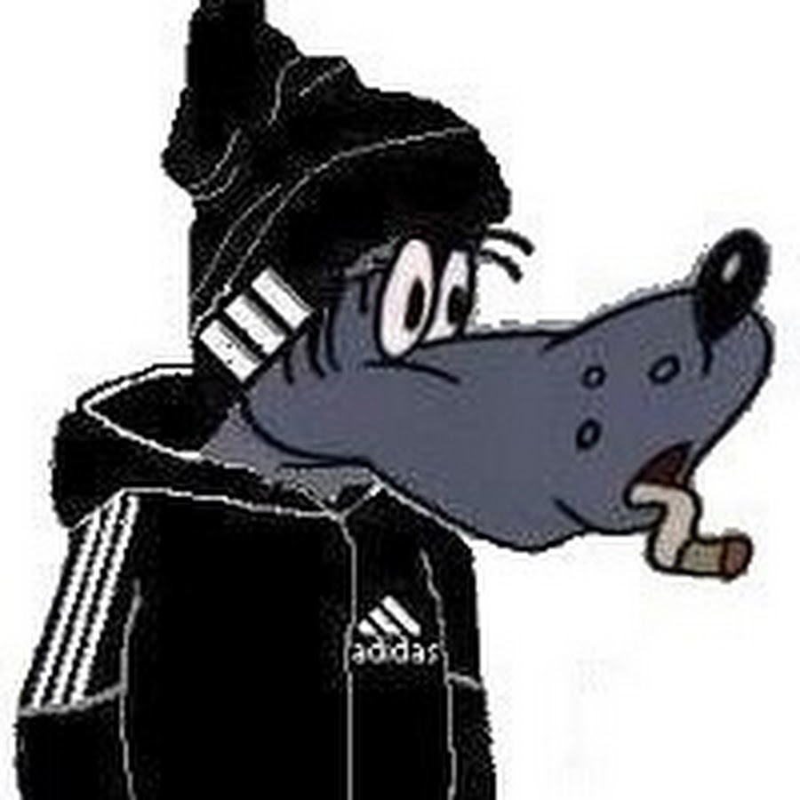

<!DOCTYPE html>
  <html>
    <head>
      <meta charset="utf-8">
        <title>Страница Ростислава</title>
          <link rel="stylesheet" href="style.css">
    </head>
    <body>
	<nav>
	  <a href="zadtwo.html">Задание 2 "Создание таблиц" |</a>
	  <a href="zadthree.html">Задание 3 "Создание форм"</a>
	</nav>
	  
	<main>
	  <section>
             
	    <h1>Обо мне</h1>
              
Привет! Меня зовут Ростислав Москвин. Я студент третьего курса ФИТиМ НВГУ и это мой первый сайт. В рамках предмета Web-программирование я проходил курсы на <a href="https://htmlacademy.ru/courses">этом сайте</a> и кое-чему научился. Теперь я могу создавать какие-нибудь простые сайты, например этот, на котором вы сейчас находитесь

               
Так же думаю имеет смысл рассказать о моей семье.

               
Чтож, в моей семье нас пятеро:

               <ul>
                 <li>Папа</li>
                 <li>Мама</li>
                 <li>Сестра Катя</li>
                 <li>Кот Газгольд(я его так зову)</li>
                 <li>и я</li>
               </ul>
               
Расскажу еще про свои хобби, о том где учусь, о моей группе и о том кем хотел бы стать:

               <ul>
                 <li><a href="hob.html">Хобби</a></li>
                 <li><a href="vuz.html">Вуз</a></li>
                 <li><a href="grup.html">Моя группа</a></li>
                 <li><a href="prof.html">Моя будущая профессия</a></li>
               </ul>
                
           </section>
	</main>
        <footer>
          

            <a href="https://nvsu.ru/">Сайт НВГУ</a>
          

          

            Москвин Ростислав 3002 ФИТиМ
          

        </footer>
    </body>
  </html>
